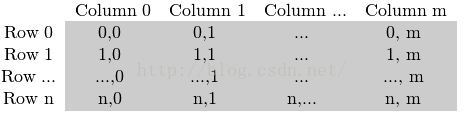
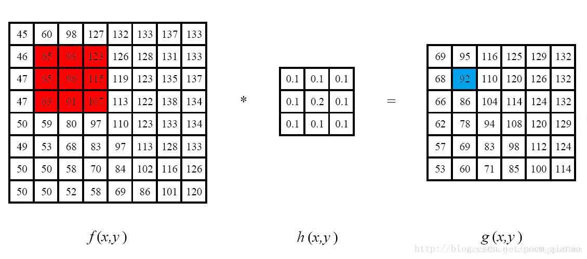
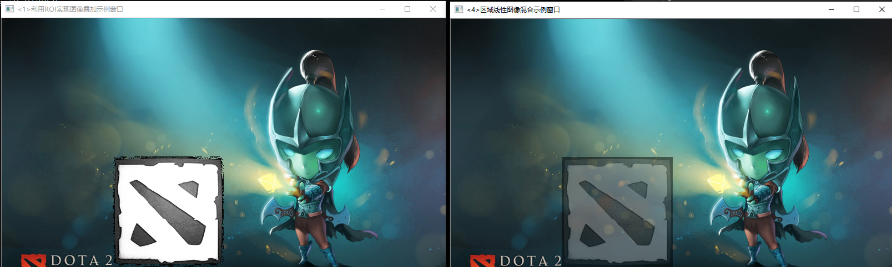
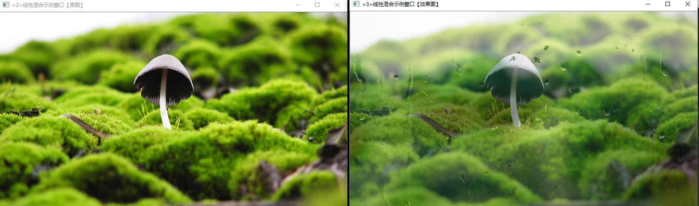
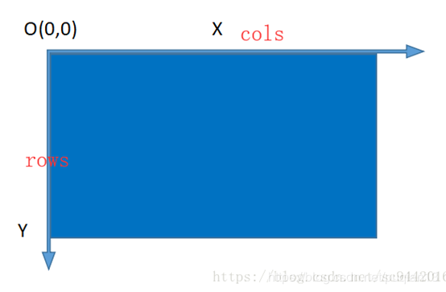

# 利用OpenCV进行图像处理

[TOC]


> 利用opencv这个开源库学习图像处理

+ 车牌识别**LPR**[License Plate Recognition]

## 图像的基础知识


### 图像的幅值

> 图像可以看做是一个定义为二维平面上的信号，该信号的幅值对应于像素的灰度（对于彩色图像则是RGB三个分量），如果我们仅仅考虑图像上某一行像素，则可以将之视为一个定义在一维空间上信号，这个信号在形式上与传统的信号处理领域的时变信号是相似的。不过是一个是定义在空间域上的，而另一个是定义在时间域上的。所以图像的频率又称为空间频率，它反映了图像的像素灰度在空间中变化的情况。例如，一面墙壁的图像，由于灰度值分布平坦，其低频成分就较强，而高频成分较弱；而对于国际象棋棋盘或者沟壑纵横的卫星图片这类具有快速空间变化的图像来说，其高频成分会相对较强，低频则较弱（注意，是相对而言）。

> 如何定量的测量图像的空间频率，最为常用的方法就是二维傅里叶变换。图像经过二维傅里叶变换后会形成与图像等大的复数矩阵，取其幅值形成幅度谱，取其相位形成相位谱。图像的频率能量分布主要体现在幅度谱中。通常习惯将低频成分放在幅度谱的中央，而将高频成分放在幅度谱边缘。

###  数字图像的表示

+ 黑白图像:0和1
+ 灰度图像
  + 
+ 彩色图像
  + 


### 图片的内存表示

> 彩色图片

  

> 一张图片由行`row` 和列`column`以及通道`channel`,而每个数值表示则用数字表示,这个数字可以用char来表示,一个char 8 bit,从-126~125 ;也可以用unsigned char 表示,则范围是0-255,
>
> 同时可以看出,颜色通道的顺序是反过来的,不是RGB,而是BGR
>
> 可以使用`isContinuous()`来判断矩阵是否连续存储


> 灰度图片

  


## 图像学原理

### 线性混合

>  核心公式

$$
g(x) = (1-\alpha)f_0(x)+\alpha f_1(x)
$$

>  令 $\theta = 1- \alpha$

$$
g(x) = \theta f_0(x) + \alpha f_1(x)
$$

> $g(x)$是由两个函数线性叠加而成.$\alpha$ 和 $\theta$ 是权重系数,取值在0到1之间.
>
> 若将两个函数看成是图像,则可以表示两个图像线性混合.


### 算子

> 一般算子都是一个函数.
>
> 对任何函数进行某一项操作,都可称为算子
>
> $ f(x) -算子-> g(f(x))$

> 对函数进行操作,都可以叫做算子

#### 点操作

> 仅仅根据输入像素值来计算相应的输出像素值

+ 亮度brightness
+ 对比度contrast
+ 颜色校正colorcorrection
+ 变换transformations

常见的点算子(点操作):

+ $g(x)=af(x)+b $
  + 在图像中,$g(i,j)=af(i,j)+b$
  + f(x)表示原图像的像素,g(x)表示输出图像像素
  + a>0 被称为增益gain,常常被用来控制图像的对比度
  + b通常称为偏置bias,常常被用来控制图像的亮度


```cpp

//改变图像的亮度和对比度
//操作像素
void test_bright_and_contrast()
{
	
	system("color 2F");//改变控制台前景色和背景色

	// 读入用户提供的图像
	Mat srcImage = imread("1.jpg");
	if (!srcImage.data) { cerr << "error when read g_srcImage!" << endl; }

	//构造一个和原图像相同的目标图像
	Mat dstImage = Mat::zeros(srcImage.size(), srcImage.type());

	//设定对比度和亮度的初值
	g_nContrastValue = 80;
	g_nBrightValue = 80;

	//创建窗口
	namedWindow("【效果图窗口】", 1);

	Mat imgs[2] = {srcImage,dstImage };


	//创建轨迹条
	createTrackbar("对比度：", "【效果图窗口】", &g_nContrastValue, 300, ContrastAndBright,imgs);
	createTrackbar("亮   度：", "【效果图窗口】", &g_nBrightValue, 200, ContrastAndBright,imgs);

	//刚开始调用回调函数来显示图像
	ContrastAndBright(g_nContrastValue, &imgs);
	ContrastAndBright(g_nBrightValue, &imgs);

	//输出一些帮助信息
	cout << endl << "\t运行成功，请调整滚动条观察图像效果\n\n"
		<< "\t按下“q”键时，程序退出\n";

	//按下“q”键时，程序退出
	while (char(waitKey(1)) != 'q') {}

}
```

```cpp
//改变亮度和对比度的回调函数
void ContrastAndBright(int, void*usrdata)
{
	//解析回调函数的
	Mat srcImage = *((Mat *)usrdata);
	Mat dstImage = *(((Mat *)usrdata)+1);


	// 三个for循环，执行运算 dstImage(i,j) = a*srcImage(i,j) + b
	for (int i = 0; i < srcImage.rows; i++)
	{
		for (int j = 0; j < srcImage.cols; j++)
		{
			for (int c = 0; c < 3; c++)//RGB 三个通道
			{//乘以0.01 是因为一般对比度在0.0到3.0之间的浮点数会有明显效果
				//又因为滑动条上的值是整数,所以用到这个转换
				dstImage.at<Vec3b>(i, j)[c] = //saturate_cast<uchar>将计算的结果转为整数
					saturate_cast<uchar>((g_nContrastValue * 0.01) * (srcImage.at<Vec3b>(i, j)[c]) + g_nBrightValue);
			}
		}
	}
	cout << "------------------" << endl;
	cout << g_nBrightValue << endl;
	cout << g_nContrastValue << endl;
	cout << "------------------" << endl;
	// 显示图像
	imshow("【效果图窗口】", dstImage);
}


```


### 离散傅里叶变换 Discrete Fourier Transform -DFT

>  因为数字图像是离散的，像素的取值是离散的，因此这里的傅里叶变换是离散形式，即DFT。 

>  图像经过傅里叶变换会分解为正弦和余弦成分。换句话说，会把一副图像从空间域转换到频域。
>
>   变换的结果是**复数** 
>
> 

> 作用:**得到图像中的几何结构信息.**
>
> 而要想得到图像的几何结构信息,只有 通过幅度.换句话说,幅度图像包含图像几何结构的所有信息.
>
> 对于图像来说:
>
> + **高频部分**代表图像的细节,纹理信息
> + **低频部分**代表了图像的轮廓信息
>
> 比如:对精细的图像进行**低通滤波器**,那么意味着低频的图像信号可以通过,排除了高频的,那么图像只剩下轮廓
>
> 如果图像受到的噪声恰好位于某个特定的频率范围内,则可以通过滤波器来恢复原来的图像

> 应用方面:
>
> + 图像增强
> + 图像去噪
> + 图像分割之边缘检测
> + 图像特征提取
> + 图像压缩
> + ...


```cpp
#include "Header.h"

//快速傅里叶变换
void test_dft()
{
	//以灰度模式读取原始图像并显示
	Mat srcImage = imread("2.jpg", 0);
	if (!srcImage.data) { cerr << "read error" << endl; }
	imshow("原始图像", srcImage);


	/*
		DFT performance is not a monotonic function of a vector size. Therefore, when you calculate
		convolution of two arrays or perform the spectral analysis of an array, it usually makes sense to
		pad the input data with zeros to get a bit larger array that can be transformed much faster than the
		original one. Arrays whose size is a power-of-two (2, 4, 8, 16, 32, ...) are the fastest to process.
		Though, the arrays whose size is a product of 2's, 3's, and 5's (for example, 300 = 5\*5\*3\*2\*2)
		are also processed quite efficiently.

		> 简而言之,就是要想进行快速傅里叶变换首先先把矩阵的size变化到power-of-two的size or product of 2's
		> 怎么做呢?填充0
		> 离散傅里叶变换的运行速度和图像的尺寸有很大关系,所以要进行处理
		> 常用的方法是通过填充新的边缘像素的方法来获取最佳图像尺寸
	*/
	//先计算出最佳的处理size
	int m = getOptimalDFTSize(srcImage.rows);
	int n = getOptimalDFTSize(srcImage.cols);

	//再将需要填充的地方进行填充
	Mat padded;//目标图像-待处理的图像
	//填充边缘像素,按照上下左右
	copyMakeBorder(srcImage, padded, 0, m - srcImage.rows, 0, n - srcImage.cols, BORDER_CONSTANT, Scalar::all(0));

	//傅里叶变换的结果是复数,这就是说对于每个原图像,结果会有两个图像值
	//频域值至少存在float格式中
	//为傅立叶变换的结果(实部和虚部)分配存储空间。
	//增加了一个复数存储部分 即zero部分
	Mat planes[] = { Mat_<float>(padded), Mat::zeros(padded.size(), CV_32F) };
	
	//将planes数组组合合并成一个多通道的数组complexI
	Mat complexI;
	merge(planes, 2, complexI);//merge将多个单通道的图像合并成一个多通道的图像

	//进行就地(in-place)离散傅里叶变换.所谓就地,就是输入和输出都是同一副图像.
	dft(complexI, complexI);

	//-------到此,DFT已经变换完了----为了用DFT获得图像的几何结构部分

	//-------处理

	//为了得到图像的幅值
	//因为幅值是需要实部和虚部,所以要进行split
	split(complexI, planes); // 将多通道数组complexI分离成几个单通道数组，planes[0] = Re(DFT(I), planes[1] = Im(DFT(I))

	//得到幅值--但是不利于观察,所以还需要一步log转换
	magnitude(planes[0], planes[1], planes[0]); 

	//planes[0]就是幅值图像
	Mat magnitudeImage = planes[0];

	//log转换
	//M1 = log(1+M)
	magnitudeImage += Scalar::all(1);
	log(magnitudeImage, magnitudeImage);//求自然对数

	//【7】剪切和重分布幅度图象限
	//若有奇数行或奇数列，进行频谱裁剪      
	magnitudeImage = magnitudeImage(Rect(0, 0, magnitudeImage.cols & -2, magnitudeImage.rows & -2));
	//重新排列傅立叶图像中的象限，使得原点位于图像中心  
	int cx = magnitudeImage.cols / 2;
	int cy = magnitudeImage.rows / 2;
	Mat q0(magnitudeImage, Rect(0, 0, cx, cy));   // ROI区域的左上
	Mat q1(magnitudeImage, Rect(cx, 0, cx, cy));  // ROI区域的右上
	Mat q2(magnitudeImage, Rect(0, cy, cx, cy));  // ROI区域的左下
	Mat q3(magnitudeImage, Rect(cx, cy, cx, cy)); // ROI区域的右下
	//交换象限（左上与右下进行交换）
	Mat tmp;
	q0.copyTo(tmp);
	q3.copyTo(q0);
	tmp.copyTo(q3);
	//交换象限（右上与左下进行交换）
	q1.copyTo(tmp);
	q2.copyTo(q1);
	tmp.copyTo(q2);

	//-- 经过对数转换之后,图像值还仍然可能不在0-1之间,所以进行归一化处理
	//非黑即白

	//【8】归一化，用0到1之间的浮点值将矩阵变换为可视的图像格式
	//此句代码的OpenCV2版为：
	//normalize(magnitudeImage, magnitudeImage, 0, 1, CV_MINMAX); 
	//此句代码的OpenCV3版为:
	normalize(magnitudeImage, magnitudeImage, 0, 1, NORM_MINMAX);

	//【9】显示效果图
	imshow("频谱幅值", magnitudeImage);
	waitKey();


}
```


### 滤波

> 图像滤波:消除图像中的噪声成分
>
> 也叫做图像的平滑化或者滤波操作

+ 信号和图像的能量大部分集中在幅度谱的低频和中频短
+ 较高频段,有用的信息被噪声淹没

目的:

+ 抽出对象的特征
+ 消除噪声

要求:

+ 不能损坏图像的轮廓和边缘等重要信息
+ 使得更清晰


#### 线性滤波

+ 剔除输入信号中不想要的频率
+ 从许多频率中选择一个想要的频率
+ 输出图像上每个像素点的值都是由输入图像各像素点值**加权求和**的结果。

##### 种类

+ 低通滤波器

  > 允许低频率通过

+ 高通滤波器

  > 允许高频率通过

+ 带通滤波器

  > 允许一定范围的频率通过

+ 带阻滤波器

  > 阻止一定范围频率通过并且允许其他频率通过

+ 全通滤波器

  > 允许所有频率通过,仅仅改变相位关系

+ 陷波滤波器

  > 阻止一个狭窄频率范围通过


##### 平滑处理smoothing 也叫模糊处理bluring

> 用来减少图像上的噪点或者失真
>
> 在涉及降低图像分辨率时,平滑处理是非常好用的方法

+ smoothing是低频增强的技术


##### 领域算子

> 也叫局部算子.
>
> 利用给定像素周围的像素值的决定此像素的最终输入像素的**加权和**.

 


##### 方框滤波 boxFilter 


##### 均值滤波 blur 


##### 高斯滤波 GaussianBlur 

+ 用高斯函数作为i滤波函数的滤波操作
+ 高斯模糊-->高斯低通滤波
+ 高斯锐化-->高斯高通滤波


#### 非线性滤波


#####  **中值滤波**   medianBlur 


#####  **双边滤波**  bilateralFilter 


## ROI:region of interest

> 定义感兴趣的地方,这样可以减少处理时间
>
> + 贴图功能


> 功能原理:
>
> 首先ROI并不是函数用来操作,而是直接在**原图像取出一部分进行操作**而已.
>
> 然后对ROI这个区域的操作就相当于作用在原图上.
>
> 所以只是缩小的操作范围,并没有什么神奇的地方.

### 定义ROI区域

1. 使用Rect

   ```cpp
   //利用感兴趣区域ROI实现图像叠加
   bool  ROI_AddImage()
   {
   
   	Mat src = imread("dota_pa.jpg");
   	Mat logo = imread("dota_logo.jpg");
   
   	if (!src.data) { cerr<<"读取srcImage1错误~！ \n"; return false; }
   	if (!logo.data) { cerr<<"读取logoImage错误~！ \n"; return false; }
   
   	cout << src.cols <<"*"<< src.rows << endl;//800*450
   	cout << logo.cols <<"*"<< logo.rows << endl;//200*200
   
   	//定义感兴趣的地方
   	Mat imageROI = src(Rect(200, 250, logo.cols, logo.rows));
   
   	Mat mask = imread("dota_logo.jpg", 0);//灰度图
   
   	//使用mask第二个参数,使得图标边缘的颜色和原图保持一致
   	logo.copyTo(imageROI, mask);
   
   	namedWindow("<1>利用ROI实现图像叠加示例窗口");
   	imshow("<1>利用ROI实现图像叠加示例窗口", src);
   
   	return true;
   }
   ```


### addWeighted()

> 计算两个数组(图像阵列)的加权和

```cpp
void addWeighted(InputArray src1, 	//加权的第一张图
                 double alpha, 		//权重
                 InputArray src2,	//和第一张图类型相同的第二张图
                 double beta, 		//权重
                 double gamma, 
                 OutputArray dst, 	//输出的数组
                 int dtype = -1		//默认相同深度
                );
```

> 

$$
dst = src1*\alpha + src2*\beta + \gamma
$$


> 例子

```cpp
//线性混合实现函数,指定区域线性图像混合
bool  ROI_LinearBlending()
{

	Mat src = imread("dota_pa.jpg", 1);
	Mat logo = imread("dota_logo.jpg");

	if (!src.data) { cerr << "读取srcImage1错误~！ \n"; return false; }
	if (!logo.data) { cerr << "读取logoImage错误~！ \n"; return false; }

	Mat imageROI;//ROI
	//方法一
	imageROI = src(Rect(200, 250, logo.cols, logo.rows));

	//方法二
	//imageROI= srcImage4(Range(250,250+logoImage.rows),Range(200,200+logoImage.cols));

	//线性混合
	addWeighted(imageROI, 0.5, logo, 0.3, 0., imageROI);

	imshow("区域线性图像混合", src);

	return true;
}
```





```cpp
//另一个实例
bool  LinearBlending()
{
	double alphaValue = 0.5;
	double betaValue;
	Mat srcImage2, srcImage3, dstImage;

	srcImage2 = imread("mogu.jpg");
	srcImage3 = imread("rain.jpg");

	if (!srcImage2.data) { cerr << "读取srcImage2错误！ \n"; return false; }
	if (!srcImage3.data) { cerr << "读取srcImage3错误！ \n"; return false; }

	// 【2】进行图像混合加权操作
	betaValue = (1.0 - alphaValue);
	addWeighted(srcImage2, alphaValue, srcImage3, betaValue, 0.0, dstImage);

	// 【3】显示原图窗口
	imshow("<2>线性混合示例窗口【原图】", srcImage2);
	imshow("<3>线性混合示例窗口【效果图】", dstImage);

	return true;

}
```





1. 指定感兴趣的行或列的范围Range


## OpenCV的数据结构


### opencv的坐标系

  


#### opencv中每个数字(灰度值:question:)表示

`CV_[位数][带符号么][类型前缀]C[通道数]`	

```cpp
CV_8UC3:表示每个数字用8bit的unsigned无符号整数存储,有三个通道

```

### Mat

#### 存储指代

> 图像本质上还是用矩阵去存储,所以Mat类本质上是矩阵`matrix`类

1. 图像
2. 矩阵

#### 历史

> 以前叫IplImage 会造成内存泄漏,所以更新完之后是Mat类
>
> + 不必手动开辟空间
> + 不必再不需要时立即将空间释放

#### 组成部分

> 1. 矩阵头
>
>    + 采用引用计数机制来复制图像
>
>   ```cpp
>   //! the matrix dimensionality, >= 2
>   int dims;
>   //! the number of rows and columns or (-1, -1) when the matrix has more than 2 dimensions
>   int rows, cols;
>   //! pointer to the data
>   uchar* data;
>   ```
>
>    + 如果是想复制完整的数据
>
>      + 采用clone() 
>
>        ```cpp
>        Mat F = A.clone();
>        ```
>    
>       + 采用 copyTo()
>    
>         ```cpp
>         A.copyTo(G);
>         ```
>
> 2. 一个指向存储所有像素值的矩阵

#### 显式创建Mat对象

##### 1. 构造函数

```cpp
Mat M(2,2,CV_8UC3,Scalar(0,0,255));
```

Scalar(0,0,255)表示初始值


##### 2. create成员函数

```cpp
Mat m;
m.create();
```

### Point

> 二维坐标系下的点


### Scalar

> 表示具有四个元素的数组.用于传递像素值.如果用不到第四个参数,可以不写.

```cpp
Scalar(a,b,c);//RGB颜色值:R:c,G:b,B:a//倒过来了
```


### Rect

> 矩形:左上角的坐标,长度,宽度


### Size

> 表示尺寸


### InputArray

> 当成Mat即可


### 颜色模型

#### RGB

#### HSV HLS


### FileStorage 类

> opencv利用xml json YAML 进行存储和恢复opencv的数据结构,不管是复杂的还是简单的.

>  Use the following procedure to write something to XML, YAML or JSON:

+  Create new FileStorage and open it for writing. It can be done with a single call to
  FileStorage::FileStorage constructor that takes a filename, or you can use the default constructor
  and then call FileStorage::open. Format of the file (XML, YAML or JSON) is determined from the filename
  extension (".xml", ".yml"/".yaml" and ".json", respectively)

+ Write all the data you want using the streaming operator `<<`, just like in the case of STL streams.

+ Close the file using FileStorage::release. FileStorage destructor also closes the file.

  

## OpenCV的函数

### imread 函数

> 原型

```cpp
CV_EXPORTS_W Mat imread( const String& filename, int flags = IMREAD_COLOR );
```

> 作用:读取图像


### glob 函数

> 原型

```cpp
CV_EXPORTS void glob(String pattern, std::vector<String>& result, bool recursive = false);
```

> 作用:遍历文件夹

```cpp
string pattern = "C:\\Users\\tailiang\\Pictures\\LPR_test\\*.jpg";
vector<String> files;
glob(pattern, files);//opencv 自带的遍历文件夹的方法
```

+ 第一个参数是搜索的模式
+ 第二个参数是一个vector但是类型是OpenCV的String
+ 第三个参数是是否递归搜索


### 操作时间

> 衡量某个算法执行的时间

```cpp
double start = static_cast<double>(getTickCount());

	//操作...

double end = static_cast<double>(getTickCount());
double during_time = (end - start) / getTickFrequency();
cout << "run time :"<<during_time << endl;
```


### 基本图形绘制

+ line 直线
+ ellipse 椭圆
+ rectangle 矩形
+ circle 圆形
+ filPoly 填充的多边形


### 滑动条

```cpp
int createTrackbar(const String& trackbarname, //滑动条的名字
                   const String& winname,		//在指定窗口显示
                   int* value,					//滑动条的当前值
                   int count,					//最大值
                   TrackbarCallback onChange = 0,//回调函数,当滑动条滑动改变时,调用的函数
                   void* userdata = 0			//回调函数的参数
                  );
```

调用:

```cpp
normalize(magnitudeImage, magnitudeImage, 0, 1, NORM_MINMAX);
```


### copyMakeBorder

> 填充图像边界像素

```cpp
void copyMakeBorder(InputArray src, //原图像
                    OutputArray dst,//目标图像 加上border之后的size的图像//Size(src.cols+left+right,src.rows+top+bottom) 
					int top, int bottom, int left, int right,//上下左右加的像素个数
					int borderType,
                    const Scalar& value = Scalar() 
                   );
```

> Border value if borderType==BORDER_CONSTANT .


### magnitude 幅值计算

>  复数有实部（Real - Re）和虚部 (imaginary - Im) 。DFT的结果是复数 

 ![[公式]](Readme.assets/equation-1583724799525.svg) 

```cpp
void magnitude(InputArray x, InputArray y, OutputArray magnitude);
```

> 第三个参数就是幅值图像,但是不利于观察,所以还需要进log转换


### normalize 归一化

```cpp
void normalize( InputArray src, 
               InputOutputArray dst, 
               double alpha = 1, 
               double beta = 0,
			   int norm_type = NORM_L2, 
               int dtype = -1, 
               InputArray mask = noArray()
              );
```


### :question:LUT 函数

> 不知为何物


### 处理像素

1. 指针访问

```cpp
void colorReduce(Mat& inputImage, Mat& outputImage, int div)
{
	outputImage = inputImage.clone();  //不作用在原图上且对图片数据部分处理=>拷贝,不能简单的赋值
	int rowNumber = outputImage.rows;  //行数
	int colNumber = outputImage.cols * outputImage.channels();  //列数 x 通道数=每一行元素的个数

	for (int i = 0; i < rowNumber; i++)  //行循环
	{
		uchar* data = outputImage.ptr<uchar>(i);  //获取第i行的首地址
		//接下来就相当于数组操作了
		for (int j = 0; j < colNumber; j++)   
		{
			data[j] = data[j] / div * div + div / 2;
		}
	}
}

```

2. 迭代器

```cpp
void colorReduce(Mat& inputImage, Mat& outputImage, int div)
{
	outputImage = inputImage.clone();  //不作用在原图上且对图片数据部分处理=>拷贝,不能简单的赋值
	//迭代器
	//typedef Vec<uchar, 3> Vec3b;//含有三个uchar的元素的向量
	Mat_<Vec3b>::iterator it = outputImage.begin<Vec3b>(); //指向的是第一行,第一列的三个通道的指针
	Mat_<Vec3b>::iterator itend = outputImage.end<Vec3b>();//指向的是最后一行,最后一列的三个通道的指针

	for (; it != itend; ++it)
	{
		(*it)[0] = (*it)[0] / div * div + div / 2;//B
		(*it)[1] = (*it)[1] / div * div + div / 2;//G
		(*it)[2] = (*it)[2] / div * div + div / 2;//R
	}
}
```

3. 动态地址运算配合at

```cpp
void colorReduce(Mat& inputImage, Mat& outputImage, int div)
{
	outputImage = inputImage.clone();  //不作用在原图上且对图片数据部分处理=>拷贝,不能简单的赋值
	int rowNumber = outputImage.rows;  //行数
	int colNumber = outputImage.cols;  //列数

	//和迭代器类似,也是指向了三通道的像素,只是表示形式不同
	for (int i = 0; i < rowNumber; i++)
	{
		for (int j = 0; j < colNumber; j++)
		{
			outputImage.at<Vec3b>(i, j)[0] = outputImage.at<Vec3b>(i, j)[0] / div * div + div / 2;  //蓝色通道
			outputImage.at<Vec3b>(i, j)[1] = outputImage.at<Vec3b>(i, j)[1] / div * div + div / 2;  //绿色通道
			outputImage.at<Vec3b>(i, j)[2] = outputImage.at<Vec3b>(i, j)[2] / div * div + div / 2;  //红是通道
		}      
	}
}

```


##  例子

> 代码参考毛星云的《OpenCV3编程入门》[百度云链接🔗](https://pan.baidu.com/s/1j5P4KtmKdvIxAqg9NuUjFQ) 提取码：`g9u9` 
> 简单感受下OpenCV的魅力

+ 头文件

  ```cpp
  #include <opencv2 / opencv.hpp>//包含了众多模块 一劳永逸
  
  using namespace std;
  using namespace cv;
  
  ```

+ 读取图像,显示图像

  ```cpp
  /*
   *@function:opencv_1_1
   *@desc:读取图像,显示图像
   *@param:
  **/
  void opencv_1_1()
  {
  	Mat srcImage = imread("1.jpg");
  	imshow("1", srcImage);
  	waitKey(0);
  }
  ```

  

+ 腐蚀图像

  ```cpp
  /*
   *@function:opencv_1_2
   *@desc:腐蚀图像
   *@param:
  **/
  void opencv_1_2()
  {
  	Mat srcImage = imread("1.jpg");
  	imshow("1", srcImage);
  
  	Mat element = getStructuringElement(MORPH_RECT, Size(15, 15));
  	Mat destImg;
  	erode(srcImage, destImg, element);
  	imshow("腐蚀", destImg);
  
  	waitKey(0);
  }
  
  ```

  

+ 均值滤波

  ```cpp
  /*
   *@function:opencv_1_3
   *@desc:均值滤波
   *@param:
  **/
  void opencv_1_3()
  {
  	Mat srcImage = imread("1.jpg");
  	imshow("1", srcImage);
  
  	Mat destImg;
  	blur(srcImage, destImg, Size(7, 7));
  	imshow("均值滤波", destImg);
  
  	waitKey(0);
  }
  
  ```

  

+ 边缘检测

  ```cpp
  /*
   *@function:opencv_1_4
   *@desc:边缘检测
   *@param:
  **/
  void opencv_1_4()
  {
  	Mat srcImage = imread("fruits.jpg");
  	imshow("1", srcImage);
  
  	Mat destImage;
  	Mat edge;
  	Mat grayImage;
  	//创建和原图同类型和大小的矩阵
  	destImage.create(srcImage.size(), srcImage.type());
  	//转换为灰度图像
  	cvtColor(srcImage, grayImage, COLOR_BGR2GRAY);
  	//先使用3*3内核来降噪
  	blur(grayImage, edge, Size(3, 3));
  	//运行Canny算子
  	Canny(edge, edge, 3, 9, 3);
  	imshow("Canny边缘检测", edge);
  	waitKey(0);
  
  }
  
  ```

  

+ 读取视频

  ```cpp
  /*
   *@function:opencv_1_5
   *@desc:读取视频
   *@param:
  **/
  void opencv_1_5()
  {
  	VideoCapture capture("1.avi");
  	//capture.open("1.avi"); 和流一样
  
  	while (true)
  	{
  		Mat frame;
  		capture >> frame;
  		imshow("读取视频", frame);
  		waitKey(30);//延时30ms
  	}
  	waitKey(0);
  
  }
  
  ```

  

+ 读取摄像头

  ```cpp
  /*
   *@function:opencv_1_6
   *@desc:读取摄像头
   *@param:
  **/
  void opencv_1_6()
  {
  	VideoCapture capture(0);//0表示摄像头
  
  	while (true)
  	{
  		Mat frame;
  		capture >> frame;
  		imshow("读取视频", frame);
  		waitKey(30);//延时30ms
  	}
  	waitKey(0);
  
  }
  // 自己尝试下 就不放自己了 哈哈啊
  ```

  

+ 通过读取摄像头进行边缘检测

  ```cpp
  /*
   *@function:opencv_1_7
   *@desc:读取摄像头并进行边缘检测
   *@param:
  **/
  void opencv_1_7()
  {
  	VideoCapture capture(0);//0表示摄像头
  	Mat edges;
  	while (true)
  	{
  		Mat frame;
  		capture >> frame;
  		//转换为灰度图像
  		cvtColor(frame, edges, COLOR_BGR2GRAY);
  		//先使用3*3内核来降噪
  		blur(edges, edges, Size(7, 7));
  		//运行Canny算子
  		Canny(edges, edges, 0, 30, 3);
  
  		imshow("canny后的视频", edges);
  		waitKey(30);
  	}
  
  }
  ```

  

+ 输出OpenCV的版本

```cpp
/*
 *@function:print_opencv_version
 *@desc:打印版本
 *@param:
**/
void print_opencv_version()
{
	printf("version:" CV_VERSION);

}
```


## 项目

### LPR

> 车牌处理的大致过程-对应于papers的文件夹
>
> 1. 车牌定位
> 2. 二值化
> 3. 车牌字符分割
> 4. 字符识别


#### 车牌分割

+ 基于彩色图色彩信息的定位
  + 回避了系统实时性的要求
+ 基于阙值分割的方法
  + 忽略了空间信息--难以解决背景复杂的图像分割问题
+ 基于边缘检测(Hough变换)的方法
  + 要求图像边缘的连续性好
+ 基于多分辨率的方法
  + 一般和别的方法共同使用,不适用于复杂的背景
+ 基于灰度聚类的方法
  + 忽略了空间信息--难以解决背景复杂的图像分割问题


### 二值化

> 二值化不是二值图像,只是将**灰度图像**利用**阙值threshold**进行了划分

+ 全局阙值
  + **oust**算法 也叫大津算法/最大间类方差法
+ 局部阙值
  + 
+ 动态阙值

```cpp
//二值化图像
void oust_method_process_image()
{
	string pattern = "C:\\Users\\tailiang\\Pictures\\LPR_test\\*.jpg";
	vector<String> files;
	glob(pattern, files);//opencv 自带的遍历文件夹的方法
	int i = 0;
	for (auto img_file : files)
	{
		Mat src_img = imread(img_file, IMREAD_GRAYSCALE);//input image 必须是灰度图片
		Mat dest_img;


		// 全局二值化 oust方法
		//double thresh_value = threshold(src_img, dest_img, 0, 255, THRESH_OTSU);
		//cout << img_file << ":" << thresh_value << endl;
		
		
		// 局部二值化--效果更好
		int maxVal = 255;
		int blockSize = 41;
		double C = 0;
		adaptiveThreshold(src_img, dest_img, maxVal, ADAPTIVE_THRESH_GAUSSIAN_C, THRESH_BINARY, blockSize,C);


		string name_win = "otsu_" + img_file;
		imshow(name_win, dest_img);
		i++;
		waitKey(30);
	}
	waitKey(0);
}
```


### 我国车牌标准 GA36-2018

[link]( https://max.book118.com/html/2019/0430/8026050061002021.shtm )

