# 利用OpenCV进行图像处理

[TOC]


> 利用opencv这个开源库学习图像处理

+ 车牌识别**LPR**[License Plate Recognition]


##  数字图像的表示

+ 黑白图像:0和1
+ 灰度图像
  + 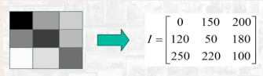
+ 彩色图像
  + 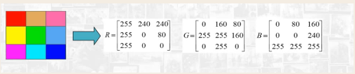

##  简单的例子

> 代码参考毛星云的《OpenCV3编程入门》[百度云链接🔗](https://pan.baidu.com/s/1j5P4KtmKdvIxAqg9NuUjFQ) 提取码：`g9u9` 
> 简单感受下OpenCV的魅力

+ 头文件

  ```cpp
  #include <opencv2 / opencv.hpp>//包含了众多模块 一劳永逸
  
  using namespace std;
  using namespace cv;
  
  ```

+ 读取图像,显示图像

  ```cpp
  
  /*
   *@function:opencv_1_1
   *@desc:读取图像,显示图像
   *@param:
  **/
  void opencv_1_1()
  {
  	Mat srcImage = imread("1.jpg");
  	imshow("1", srcImage);
  	waitKey(0);
  }
  ```

  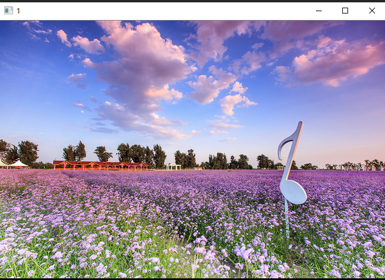

+ 腐蚀图像

  ```cpp
  /*
   *@function:opencv_1_2
   *@desc:腐蚀图像
   *@param:
  **/
  void opencv_1_2()
  {
  	Mat srcImage = imread("1.jpg");
  	imshow("1", srcImage);
  
  	Mat element = getStructuringElement(MORPH_RECT, Size(15, 15));
  	Mat destImg;
  	erode(srcImage, destImg, element);
  	imshow("腐蚀", destImg);
  
  	waitKey(0);
  }
  
  ```

  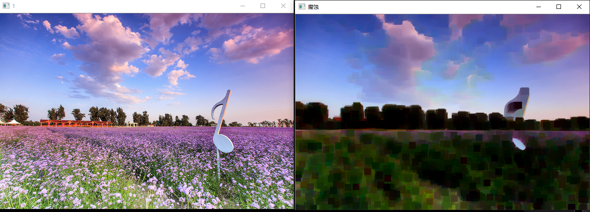

+ 均值滤波

  ```cpp
  /*
   *@function:opencv_1_3
   *@desc:均值滤波
   *@param:
  **/
  void opencv_1_3()
  {
  	Mat srcImage = imread("1.jpg");
  	imshow("1", srcImage);
  
  	Mat destImg;
  	blur(srcImage, destImg, Size(7, 7));
  	imshow("均值滤波", destImg);
  
  	waitKey(0);
  }
  
  ```

  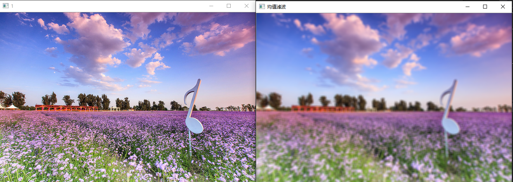

+ 边缘检测

  ```cpp
  /*
   *@function:opencv_1_4
   *@desc:边缘检测
   *@param:
  **/
  void opencv_1_4()
  {
  	Mat srcImage = imread("fruits.jpg");
  	imshow("1", srcImage);
  
  	Mat destImage;
  	Mat edge;
  	Mat grayImage;
  	//创建和原图同类型和大小的矩阵
  	destImage.create(srcImage.size(), srcImage.type());
  	//转换为灰度图像
  	cvtColor(srcImage, grayImage, COLOR_BGR2GRAY);
  	//先使用3*3内核来降噪
  	blur(grayImage, edge, Size(3, 3));
  	//运行Canny算子
  	Canny(edge, edge, 3, 9, 3);
  	imshow("Canny边缘检测", edge);
  	waitKey(0);
  
  }
  
  ```

  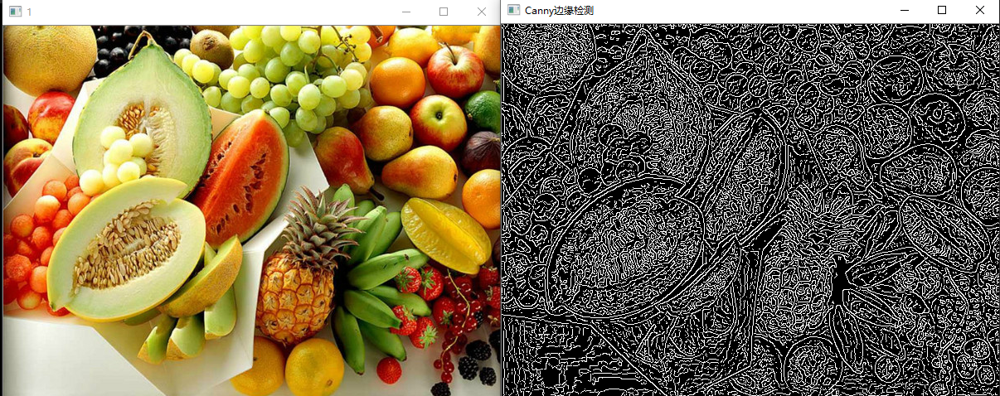

+ 读取视频

  ```cpp
  /*
   *@function:opencv_1_5
   *@desc:读取视频
   *@param:
  **/
  void opencv_1_5()
  {
  	VideoCapture capture("1.avi");
  	//capture.open("1.avi"); 和流一样
  
  	while (true)
  	{
  		Mat frame;
  		capture >> frame;
  		imshow("读取视频", frame);
  		waitKey(30);//延时30ms
  	}
  	waitKey(0);
  
  }
  
  ```

  

+ 读取摄像头

  ```cpp
  /*
   *@function:opencv_1_6
   *@desc:读取摄像头
   *@param:
  **/
  void opencv_1_6()
  {
  	VideoCapture capture(0);//0表示摄像头
  
  	while (true)
  	{
  		Mat frame;
  		capture >> frame;
  		imshow("读取视频", frame);
  		waitKey(30);//延时30ms
  	}
  	waitKey(0);
  
  }
  // 自己尝试下 就不放自己了 哈哈啊
  ```

  

+ 通过读取摄像头进行边缘检测

  ```cpp
  /*
   *@function:opencv_1_7
   *@desc:读取摄像头并进行边缘检测
   *@param:
  **/
  void opencv_1_7()
  {
  	VideoCapture capture(0);//0表示摄像头
  	Mat edges;
  	while (true)
  	{
  		Mat frame;
  		capture >> frame;
  		//转换为灰度图像
  		cvtColor(frame, edges, COLOR_BGR2GRAY);
  		//先使用3*3内核来降噪
  		blur(edges, edges, Size(7, 7));
  		//运行Canny算子
  		Canny(edges, edges, 0, 30, 3);
  
  		imshow("canny后的视频", edges);
  		waitKey(30);
  	}
  
  }
  ```

  

+ 输出OpenCV的版本

```cpp
/*
 *@function:print_opencv_version
 *@desc:打印版本
 *@param:
**/
void print_opencv_version()
{
	printf("version:" CV_VERSION);

}
```

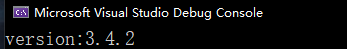


## 二值化

> 二值化不是二值图像,只是将**灰度图像**利用**阙值threshold**进行了划分

+ 全局阙值
  + **oust**算法 也叫大津算法/最大间类方差法
+ 局部阙值
  + 
+ 动态阙值

```cpp

//二值化图像
void oust_method_process_image()
{
	string pattern = "C:\\Users\\tailiang\\Pictures\\LPR_test\\*.jpg";
	vector<String> files;
	glob(pattern, files);//opencv 自带的遍历文件夹的方法
	int i = 0;
	for (auto img_file : files)
	{
		Mat src_img = imread(img_file, IMREAD_GRAYSCALE);//input image 必须是灰度图片
		Mat dest_img;


		// 全局二值化 oust方法
		//double thresh_value = threshold(src_img, dest_img, 0, 255, THRESH_OTSU);
		//cout << img_file << ":" << thresh_value << endl;
		
		
		// 局部二值化--效果更好
		int maxVal = 255;
		int blockSize = 41;
		double C = 0;
		adaptiveThreshold(src_img, dest_img, maxVal, ADAPTIVE_THRESH_GAUSSIAN_C, THRESH_BINARY, blockSize,C);


		string name_win = "otsu_" + img_file;
		imshow(name_win, dest_img);
		i++;
		waitKey(30);
	}
	waitKey(0);
}
```


## OpenCV的函数

### imread 函数

> 原型

```cpp
CV_EXPORTS_W Mat imread( const String& filename, int flags = IMREAD_COLOR );
```

> 作用:读取图像

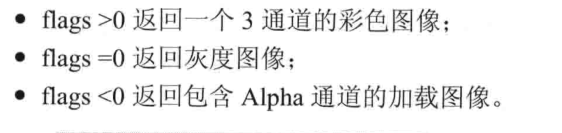

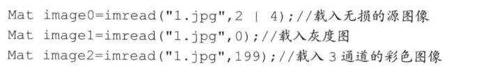

### glob 函数

> 原型

```cpp
CV_EXPORTS void glob(String pattern, std::vector<String>& result, bool recursive = false);
```

> 作用:遍历文件夹

```cpp
string pattern = "C:\\Users\\tailiang\\Pictures\\LPR_test\\*.jpg";
vector<String> files;
glob(pattern, files);//opencv 自带的遍历文件夹的方法
```

+ 第一个参数是搜索的模式
+ 第二个参数是一个vector但是类型是OpenCV的String
+ 第三个参数是是否递归搜索


## OpenCV的数据结构

### 图片的内存表示

> 彩色图片

  

> 一张图片由行`row` 和列`column`以及通道`channel`,而每个数值表示则用数字表示,这个数字可以用char来表示,一个char 8 bit,从-126~125 ;也可以用unsigned char 表示,则范围是0-255,
>
> 同时可以看出,颜色通道的顺序是反过来的,不是RGB,而是BGR
>
> 可以使用`isContinuous()`来判断矩阵是否连续存储


> 灰度图片

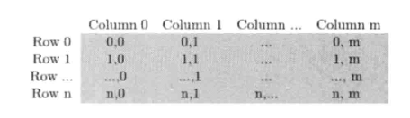


#### opencv中每个数字(灰度值:question:)表示

`CV_[位数][带符号么][类型前缀]C[通道数]`

```cpp
CV_8UC3:表示每个数字用8bit的unsigned无符号整数存储,有三个通道

```


### Mat

#### 存储指代

> 图像本质上还是用矩阵去存储,所以Mat类本质上是矩阵`matrix`类

1. 图像
2. 矩阵

#### 历史

> 以前叫IplImage 会造成内存泄漏,所以更新完之后是Mat类
>
> + 不必手动开辟空间
> + 不必再不需要时立即将空间释放

#### 组成部分

> 1. 矩阵头
>
>    + 采用引用计数机制来复制图像
>
>      ```cpp
>      //! the matrix dimensionality, >= 2
>      int dims;
>      //! the number of rows and columns or (-1, -1) when the matrix has more than 2 dimensions
>      int rows, cols;
>      //! pointer to the data
>      uchar* data;
>      ```
>
>    + 如果是想复制完整的数据
>
>      + 采用clone() 
>
>        ```cpp
>        Mat F = A.clone();
>        ```
>    
>      + 采用 copyTo()
>    
>        ```cpp
>        A.copyTo(G);
>        ```
>
> 2. 一个指向存储所有像素值的矩阵

#### 显式创建Mat对象

##### 1. 构造函数

```cpp
Mat M(2,2,CV_8UC3,Scalar(0,0,255));
```

Scalar(0,0,255)表示初始值

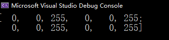

##### 2. create成员函数

```cpp
Mat m;
m.create();
```

### Point

> 二维坐标系下的点


### Scalar

> 表示具有四个元素的数组.用于传递像素值.如果用不到第四个参数,可以不写.

```cpp
Scalar(a,b,c);//RGB颜色值:R:c,G:b,B:a//倒过来了
```


### Rect

> 矩形:左上角的坐标,长度,宽度


### Size

> 表示尺寸


### InputArray

> 当成Mat即可


### 颜色模型

#### RGB

#### HSV HLS


## 基本图形绘制

+ line 直线
+ ellipse 椭圆
+ rectangle 矩形
+ circle 圆形
+ filPoly 填充的多边形


## 项目

### LPR

> 车牌处理的大致过程-对应于papers的文件夹
>
> 1. 车牌定位
> 2. 二值化
> 3. 车牌字符分割
> 4. 字符识别


#### 车牌分割

+ 基于彩色图色彩信息的定位
  + 回避了系统实时性的要求
+ 基于阙值分割的方法
  + 忽略了空间信息--难以解决背景复杂的图像分割问题
+ 基于边缘检测(Hough变换)的方法
  + 要求图像边缘的连续性好
+ 基于多分辨率的方法
  + 一般和别的方法共同使用,不适用于复杂的背景
+ 基于灰度聚类的方法
  + 忽略了空间信息--难以解决背景复杂的图像分割问题


### 我国车牌标准 GA36-2018

[link]( https://max.book118.com/html/2019/0430/8026050061002021.shtm )

